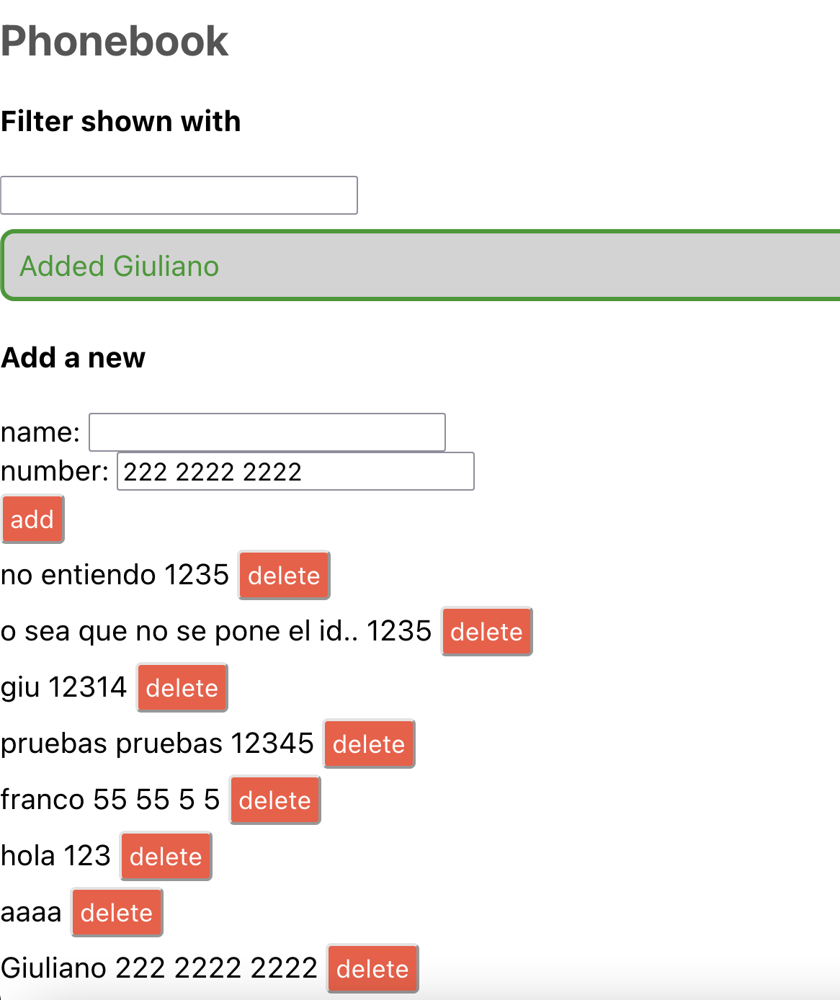

Helsinki fullstack exercises

<strong>countries</strong>

<strong>phonebook</strong>

node.js structure...

├── index.js

├── app.js

├── build

│ └── ...

├── controllers

│ └── notes.js

├── models

│ └── note.js

├── package-lock.json

├── package.json

├── utils

│ ├── config.js

│ ├── logger.js

│ └── middleware.js

